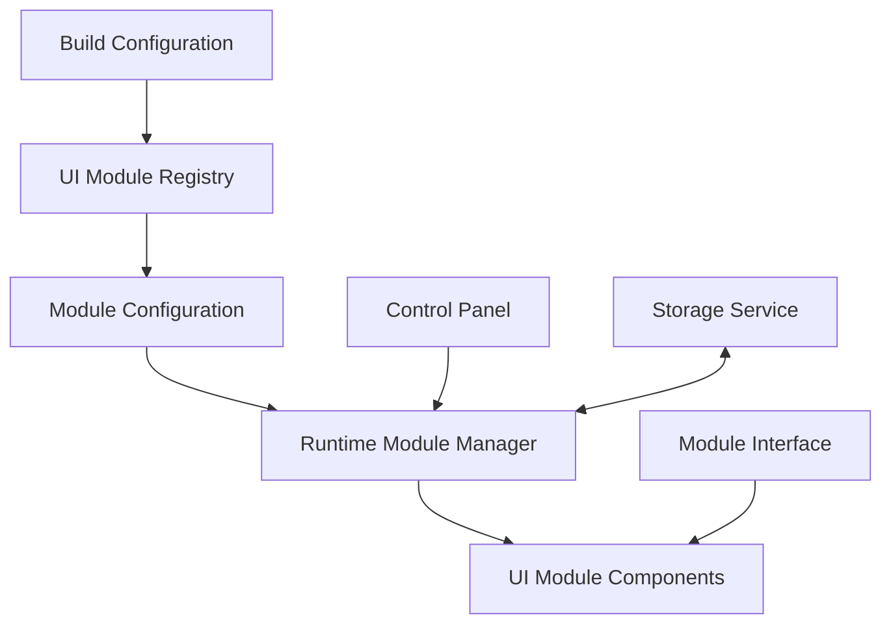
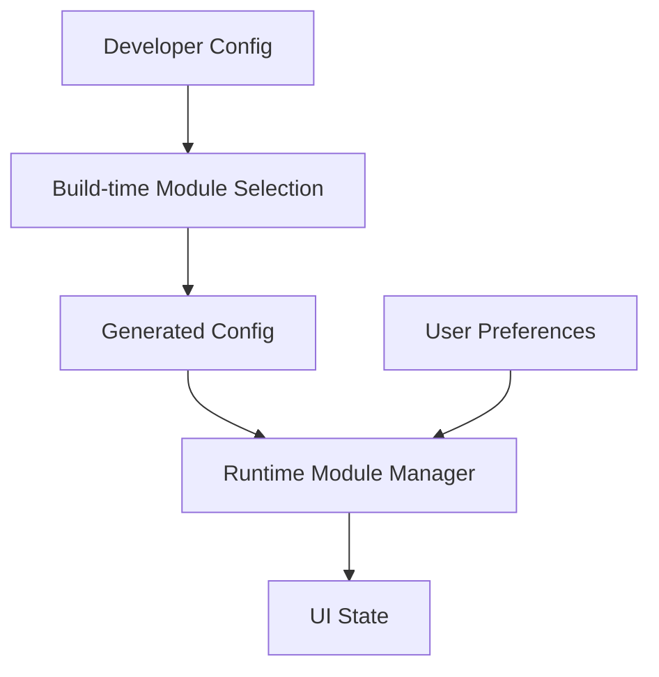

# Modular UI Architecture Plan

## 1. Overview

This plan outlines a flexible architecture that allows:
- Developers to select which UI modules to include in their builds
- End users to toggle the visibility of included modules at runtime
- A consistent interface for all modules regardless of their functionality

The approach balances build-time configuration and runtime toggling to provide maximum flexibility with minimal code changes.

## 2. Core Architecture Components



### Key Components:

1. **UI Module Registry**
   - Central repository of all available UI modules
   - Each module self-registers with metadata (name, description, default visibility)
   - Provides discovery and management capabilities

2. **Module Configuration**
   - Build-time configuration to include/exclude modules
   - Developer-facing API for module selection
   - Tree-shakable to ensure unused modules aren't included in the bundle

3. **Runtime Module Manager**
   - State management for module visibility
   - API for toggling modules programmatically
   - Persistence of user preferences

4. **UI Control Panel**
   - Compact interface for toggling module visibility
   - Configurable position and appearance
   - Accessible keyboard shortcuts for power users

5. **Module Interface**
   - Standardized contract for all UI modules
   - Lifecycle hooks (mount, unmount, visibility change)
   - Access to shared services and context

## 3. Implementation Approach

### 3.1 Module Definition System

```typescript
// Define a standard module interface
interface UIModule {
  id: string;
  name: string;
  description?: string;
  defaultVisible: boolean;
  category?: 'debug' | 'chat' | 'tools' | 'custom';
  component: React.ComponentType<any>;
  requiredPermissions?: string[];
  dependencies?: string[];
}

// Module registry
class ModuleRegistry {
  private modules: Map<string, UIModule> = new Map();
  
  register(module: UIModule): void {
    this.modules.set(module.id, module);
  }
  
  getAvailableModules(): UIModule[] {
    return Array.from(this.modules.values());
  }
  
  getModule(id: string): UIModule | undefined {
    return this.modules.get(id);
  }
}
```

### 3.2 Configuration System



The configuration system will have two layers:
1. **Build-time configuration** - Allows developers to select which modules to include
2. **Runtime configuration** - Allows end-users to toggle visibility of included modules

### 3.3 Runtime Visibility Management

We'll implement a React context to manage module visibility:

```typescript
interface ModuleVisibilityState {
  [moduleId: string]: boolean;
}

const ModuleVisibilityContext = React.createContext<{
  visibilityState: ModuleVisibilityState;
  toggleModule: (moduleId: string) => void;
  setModuleVisibility: (moduleId: string, visible: boolean) => void;
}>({
  visibilityState: {},
  toggleModule: () => {},
  setModuleVisibility: () => {},
});
```

### 3.4 Control Panel Implementation

A minimal, collapsible control panel that lists available modules with toggle switches:

```typescript
const UIControlPanel: React.FC = () => {
  const { modules } = useModuleRegistry();
  const { visibilityState, toggleModule } = useModuleVisibility();
  
  return (
    <Panel position="top-right" collapsible defaultCollapsed>
      <h3>UI Modules</h3>
      <List>
        {modules.map(module => (
          <ListItem key={module.id}>
            <Toggle
              label={module.name}
              checked={visibilityState[module.id] ?? module.defaultVisible}
              onChange={() => toggleModule(module.id)}
            />
          </ListItem>
        ))}
      </List>
    </Panel>
  );
};
```

## 4. Module Integration Strategy

### 4.1 Converting Existing Components

Existing components like DebugPanel and ChatOverlay need to be wrapped to conform to the module interface:

```typescript
// Example of converting DebugPanel to a module
const DebugPanelModule: UIModule = {
  id: 'debug-panel',
  name: 'Debug Panel',
  description: 'Inspects component properties and state',
  defaultVisible: false,
  category: 'debug',
  component: DebugPanel,
};

moduleRegistry.register(DebugPanelModule);
```

### 4.2 Module Composition

For more complex modules with sub-components:

```typescript
// Modular Debug Panel with optional features
const DebugPanelModule: UIModule = {
  id: 'debug-panel',
  name: 'Debug Panel',
  description: 'Inspects component properties and state',
  defaultVisible: false,
  category: 'debug',
  component: props => (
    <DebugPanel 
      {...props}
      showRelationships={isModuleEnabled('debug-relationships')}
      showPerformance={isModuleEnabled('debug-performance')}
      showVersionControl={isModuleEnabled('debug-version-control')}
    />
  ),
};
```

## 5. Persistence Strategy

User preferences will be saved to ensure settings persist across sessions:

```typescript
// Storage service
const saveModuleVisibility = (state: ModuleVisibilityState) => {
  localStorage.setItem('ui-module-visibility', JSON.stringify(state));
};

const loadModuleVisibility = (): ModuleVisibilityState => {
  try {
    const saved = localStorage.getItem('ui-module-visibility');
    return saved ? JSON.parse(saved) : {};
  } catch (e) {
    console.error('Failed to load module visibility settings', e);
    return {};
  }
};
```

## 6. Developer Experience

### 6.1 API Design

```typescript
// Simple setup for developers
const App = () => (
  <ModuleProvider
    modules={['chat-overlay', 'debug-panel']} // Include only these modules
    defaultVisibility={{ 'chat-overlay': true }} // Override default visibility
  >
    <YourApplication />
    <UIModuleRenderer /> {/* Renders all active modules */}
  </ModuleProvider>
);
```

### 6.2 Configuration Options

```typescript
// In the app's configuration
const moduleConfig = {
  include: ['chat-overlay', 'debug-panel'],  // Modules to include
  exclude: [],  // Modules to exclude
  defaults: {  // Default visibility settings
    'chat-overlay': true,
    'debug-panel': false
  },
  controlPanel: {  // Control panel settings
    enabled: true,
    position: 'top-right',
    shortcut: 'Alt+M'
  }
};
```

## 7. Implementation Phases

1. **Phase 1: Core Architecture**
   - Implement module registry
   - Create visibility management context
   - Develop basic control panel

2. **Phase 2: Module Conversion**
   - Convert existing components to modules
   - Implement persistence layer
   - Add keyboard shortcuts

3. **Phase 3: Developer API**
   - Create build-time configuration
   - Develop documentation
   - Create example implementations

4. **Phase 4: Advanced Features**
   - Module dependencies and relationships
   - Module communication system
   - Advanced positioning and layout controls

## 8. Advantages of This Approach

1. **Flexibility**: Developers can include only what they need
2. **User Control**: End-users can manage screen space by toggling components
3. **Maintainability**: Each module is isolated with a standard interface
4. **Extensibility**: Easy to add new modules that follow the same pattern
5. **Performance**: Only loaded modules consume resources

## 9. Potential Challenges and Mitigations

1. **Challenge**: Module dependencies might be complex
   **Mitigation**: Implement a dependency resolution system

2. **Challenge**: Too many modules could make the control panel cluttered
   **Mitigation**: Add categorization and search to the control panel

3. **Challenge**: Tree-shaking might not work perfectly
   **Mitigation**: Create explicit build configurations